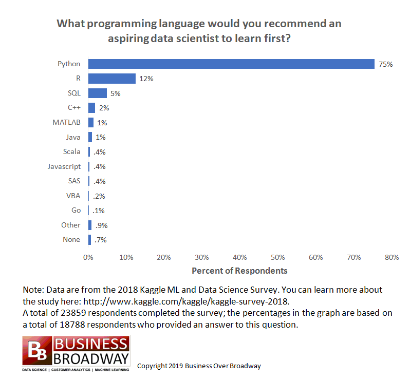
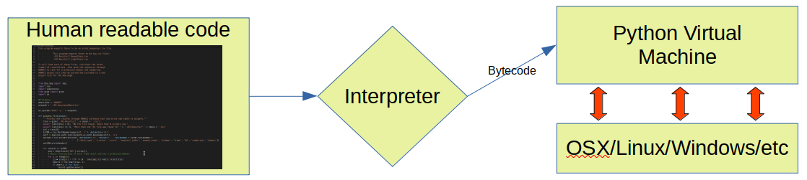
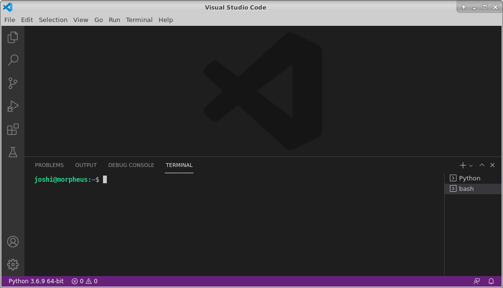
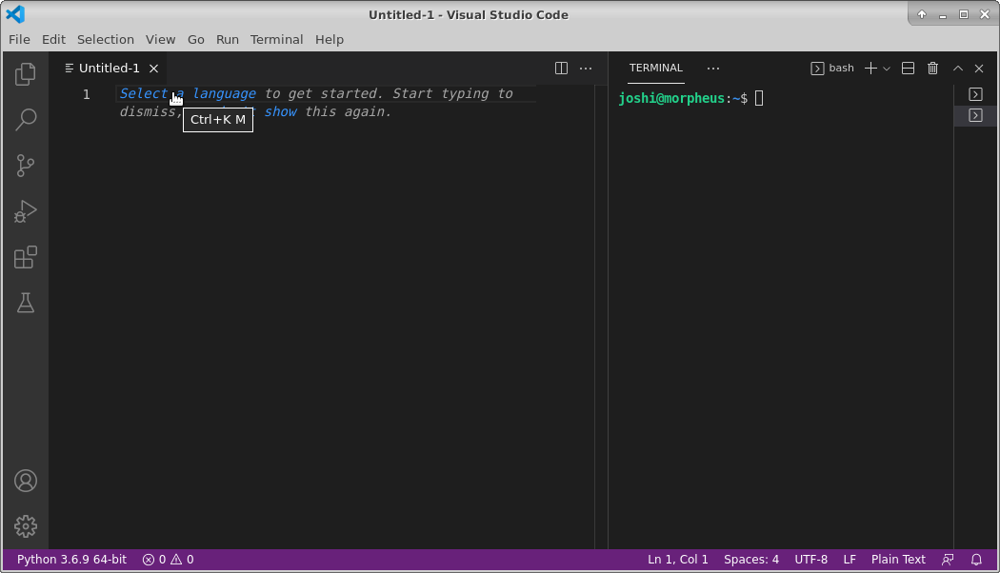
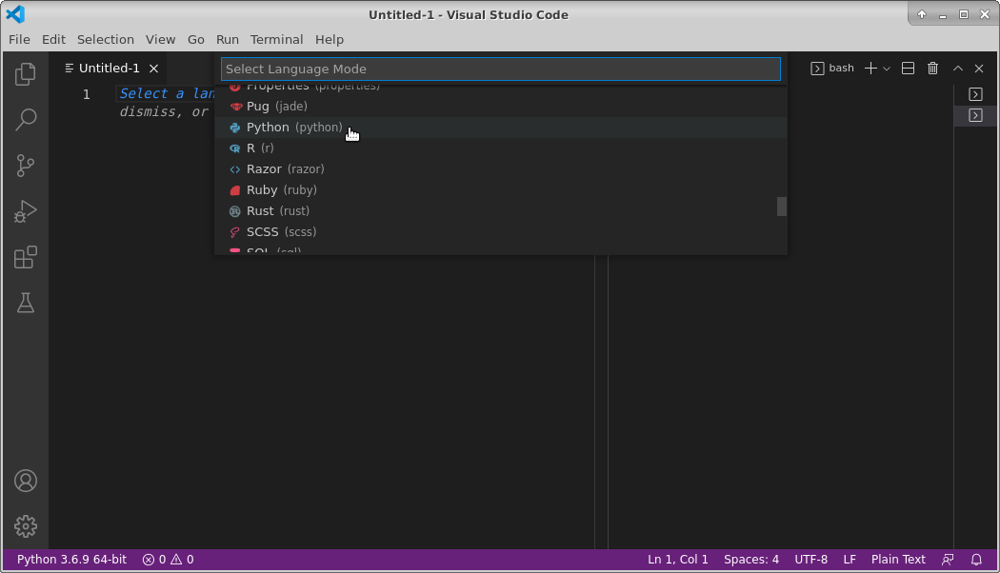
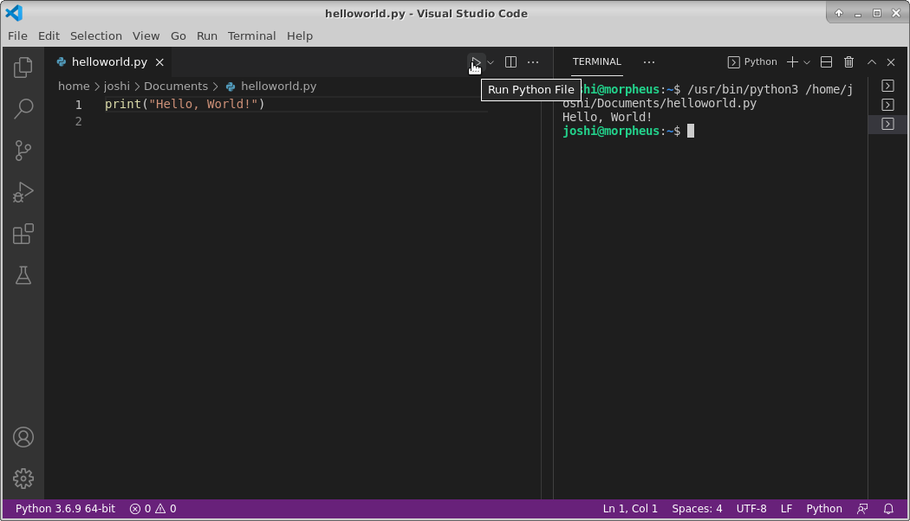

## Part 1: Intro to Python

### Why learn Python?




https://businessoverbroadway.com/2019/01/13/programming-languages-most-used-and-recommended-by-data-scientists/


-  Python is extremely popular and widely used, especially for data science.
    +  Popular and getting more so in Bioinformatics, especially for building tools.
    +  For analysis, R (which you will learn later in the week) is arguably more useful currently due to the huge number of packages available from [Bioconductor](http://bioconductor.org/) and [CRAN](https://cran.r-project.org/). 
    +  The best option is to learn [Python, R, and bash](http://omgenomics.com/programming-languages/). A little of each will go a long way.
-  Freely available to [download](https://www.python.org/downloads/) for Windows, Linux, Mac OS X, etc.
-  Python is extremely versatile
    +  Used for a wide range of purposes from automating simple tasks to massive software projects with wide adoption [by many large companies.](https://realpython.com/world-class-companies-using-python/)
-  Installed on almost every Linux server.
-  Vast number of resources online: If you can Google for it you can learn how to do it.


------

##  Background

###  What is a programming language and why do we need it?

Speaking to a computer in its native language is tedious and complicated. A programming language is a way for humans to describe a set of operations to a computer in a more abstract and understandable way. A helper program then translates our description of the operations into a set of instructions (machine code) for the computer to carry out.<br> 

Some day we may develop a programming language that allows us to communicate our instructions to the computer in our native language (Alexa, turn on the TV). Except for simple cases, this option doesn't exist yet, largely because human languages are complicated and instructions can be difficult to understand (even for other humans).


In order for the helper program to work properly, we need to use a concise language:
-  Well defined vocabulary for describing the basic set of supported operations.
-  Well defined set of Data Types that have a defined set of valid operations (add, subtract, etc).
-  Well defined syntax that leaves no ambiguity about when the computer should carry out each instruction.

Specifically in Python:

 <br><br>


-----

### A brief history of Python
-  Initially developed during the late 1980's by [Guido van Rossum](https://en.wikipedia.org/wiki/Guido_van_Rossum), BDFL until 2018.
-  First development version released in 1991. Version 1 released in 1994.
-  Python 2.0.0 released June, 2001
    -  Python 2.x end-of-life Jan 1, 2020.
    -  This version was so popular and widely used that many Bioinformatics programs were written using it. Some of these tools have been converted to support v3.x, others are in the process of being upgraded or have been abandoned and will stay on v2.x. The last Python 2.x release is still available for [download](https://www.python.org/downloads/release/python-2718/).
-  Python 3.x (December 2008) was a significant re-design and broke compatibility with some parts of v2.x.
-  The current version is 3.10.1.


------

### Interesting features of Python
-  High level: It hides a lot of the complicated details.
-  Interpreted: programs are compiled to byte code and run on a virtual machine instead of being compiled to native machine language
    -  This provides the option of running Python interactively, or writing Python scripts.
-  Garbage Collected: memory is allocated and freed for you automatically
-  Spaces matter in Python and are part of the language syntax. Be careful with copy/paste!
-  In Python, "Readability counts". 
    *  There is a style guide called [Python Enhancement Proposal 8 (PEP8)](https://www.python.org/dev/peps/pep-0008/) that documents and encourages consistent, readable code. If you plan to share your code with others, it is good practice to follow the style guide (or adopt the style used by the rest of the team). 
    *  These best practices are also known as writing "pythonic" or "idiomatic" python, [this guide](https://docs.python-guide.org/writing/style/) has more details. Try ```import this``` in your Python interpreter if you are a fan of programmer philosophy.

----

### Base Python and the extensive package ecosystem
-  Python has been extremely successful partly because it is modular and highly extensible. The core of Python is relatively small and compact, but this is supplemented with a large ["standard library"](https://docs.python.org/3/library/) that adds a large amount of additional functionality.
    +  Thousands of additional packages are available from the [PyPI](https://pypi.org/) repository.
    +  PythonPath variable
    +  Where do libraries live?
    +  Virtual Environments 
    +  Conflicts and package versions
        -  Virtual environments
        -  Conda


---------

### Your first Python program

First, open VSCode:



You will be asked to choose a language for the new file. VSCode supports many different programming languages, including C, C++, Java, Perl, Python. Choose Python.

<br>



[Hello, World!](https://en.wikipedia.org/wiki/%22Hello,_World!%22_program) is traditionally the first program to write in any new programming language.

Copy and paste (or type) this into your new file:

    print("Hello, World!")

Save the file and name it "helloworld.py". Python code files typically use the ".py" extension. Then click the triangle "play" button to run your code in the terminal. Congratulations! You are now a python coder!



