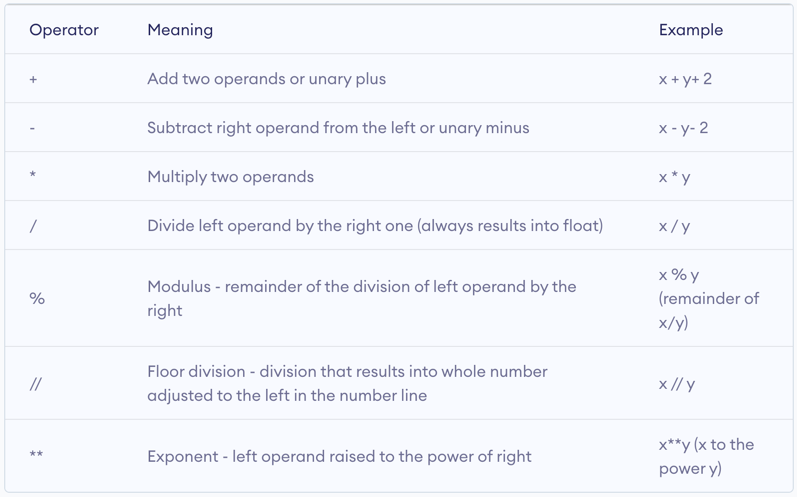

# Part 2: Basics of Python, Variables, and Basic Data Types


A few notes before we get started:
- Learning all the nuances of python takes a long time! Our goal here is to introduce you to as many concepts as possible
but if you are serious about mastering python you will need to apply yourself beyond this introduction. 
- We bring up a lot of concepts to expose you to them but we encourage you to have a "scientific" mentality and highly
encourage you to continue testing the waters beyond these materials. 
- Python can be run interactively, however, we will be saving the code to files to be run in VSCode. We will be using the "print" function to output values to the terminal.

## Variables

What is a variable? A variable is named storage that can be used to store anything from numbers to characters to much more complex data. In other languages, one needs to specify the "type" of the variable before assigning values, however, in python that is not the case. In python, a variable's type is determined by the value it is assigned. Variable names can contain only alphanumeric characters (A-Z, a-z, 0-9) and underscore (\_) and no other special characters and cannot start with a number. In the following section, you should copy and paste (or type) the code into your "helloworld.py" file and run the code each time to see the output in the terminal.

# Basic Data Types: Integers, Floating-point numbers, booleans, strings.

### Integers
whole numbers, negative or positive

```
gene_count = 7
print(gene_count)
```

### Floats
basically Real numbers

```
gene_exp = 3.89
print(gene_exp)
```

### Strings
Any text (including all symbols and spaces) is called a "string". Strings are designated by quotes around the text.

```
gene_id = "BRCA2"
print(gene_id)
hw = "HELLO!!! WORLD!!!"
print(hw)
```

### Booleans

"In computer science, the Boolean data type is a data type that has one of two possible values (usually denoted true 
and false) which is intended to represent the two truth values of logic and Boolean algebra. It is named after George 
Boole, who first defined an algebraic system of logic in the mid 19th century." [-wikipedia](https://en.wikipedia.org/wiki/Boolean_data_type)

```
control = False
treatment = True
print(control)
print(treatment)
```

Booleans come into play when making comparisons. The simplest comparisons are comparing integers:

```
print(1<1)
print(1<2)
print(2>1)
print(1<=1)
print(2>=1)

# the double equals is an equality comparison, a single equals is for assignment.
print(1==1)
print(0==1)

# You can also do string comparisons
print(gene_id == "BRCA2")
print(hw == "hello")
```

## Built-in datatypes and the type function

You can use the "type" function to query the type of a variable:

```
print("The data type of the variable 'control' is:")
print(type(control))
print("The data type of the variable 'hw' is:")
print(type(hw))
print("The data type of the variable 'gene_count' is:")
print(type(gene_count))
```

Here is a list of the built-in datatypes and their corresponding category:

Text Type: str<br>
Numeric Types: int, float, complex<br>
Sequence Types: list, tuple, range<br>
Mapping Type: dict<br>
Set Types: set, frozenset<br>
Boolean Type: bool<br>
Binary Types: bytes, bytearray, memoryview<br>


# Arithmetic: Adding, subtracting, multiplication, assignment arithmetic (assignment operators).


```
# This is a comment. Comments are lines that being with a hashtag symbol.
# They are ignored by the python interpreter and are used to document your code.
a = 21
b = 34

# Addition
print(a + b)

# Subtraction
print(b - a)

# Division
print(a/b)

# Exponents
print(4**b)
#or
expb = pow(4,b)
print(expb)

# Remainder 
print(4 % 3)

# Absolute value
av = abs(22-32)
print(av)

# Round, Floor, Ceiling
print(round(3.2))
print(int(3.2))
import math
print(math.ceil(3.2))
print(math.floor(3.7))
print(int(3.7))
```