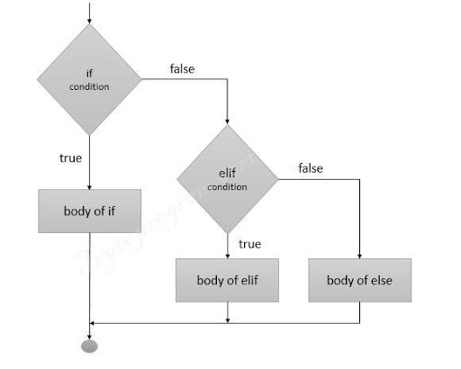
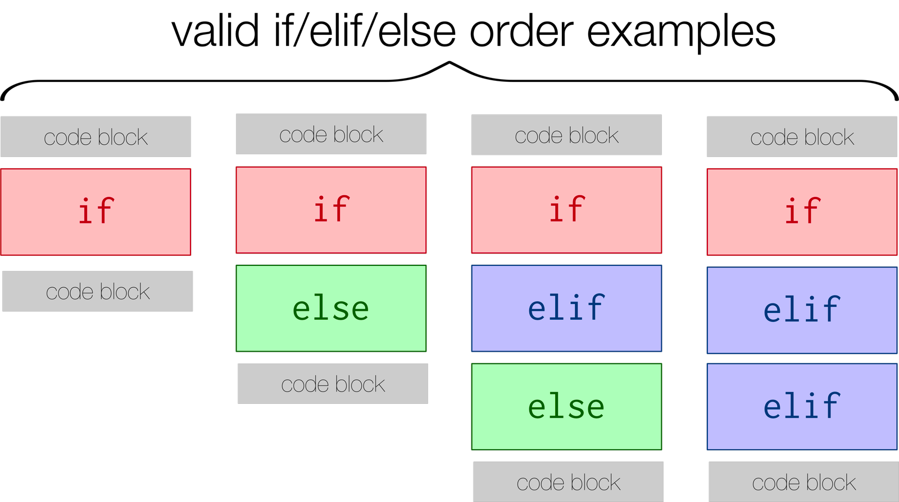

# Flow Control

Flow control is the bread and butter of programming. It is how you can program different paths for the program to take or to loop through a task many times.

## If,elif,else statements

- An "If statement" is a programming construct that allows you to execute code based on if a condition is met.

- If, elif (else if), and else statements are used in python to control what happens based on the circumstance of one or more events:
    +  

- The following are valid orders of statements. In both scenarios where elif is, as many elif statements can be there as desired.
    +  

\*\*\***INDENTATION MATTERS!!!**\*\*\*

In many other languages, the "body" of an "if statement" (or any other programming construct that has a "body") is designated by curly braces. However, python doesn't do that. Instead, the "body" is designated by indentation. Any code that is indented to the same level is considered to be part of the same "body". The "condition" of the if statement is evaluated to be True or False. If True, then the code block associated with that statement is executed and not any others. If False, then the next statement is evaluated. "else" is the catchall default.

```
print("\nIF Statements\n")

diffexp = 67
if (diffexp > 0):
	print("Upregulated")
else:
	print("Downregulated")

diffexp = -9
if (diffexp > 0):
	print("Upregulated")
else:
	print("Downregulated")

# An if statement doesn't need an else
if (diffexp < 0):
	print("Downregulated")

# If statements can have multiple elif (else if)
# Try changing the value of diffexp to see how the output changes.
diffexp = 25
if (diffexp > 50):
	print("Very Upregulated")
elif (diffexp > 0):
	print("Upregulated")
elif (diffexp < 0):
	print("Downregulated")
elif (diffexp < -50):
	print("Very Downregulated")

# You can use "and" & "or" to write more complex conditions
if (diffexp > 0 and diffexp < 50):
	print("Differential expression between 0 and 50")

if (diffexp < -50 or diffexp > 50):
	print("High Down or Up regulation")

# The body of an if statement can have multiple lines of code
diffexp=25
if (diffexp > 0 and diffexp < 50):
	print("Differential expression between 0 and 50")
	print("Check the significance")

# You can have if statements inside of other if statements
sig = 0.049
if (diffexp > 0 and diffexp < 50):
	print("Differential expression between 0 and 50")

	if (sig < 0.05):
		print("It's significant!")
```